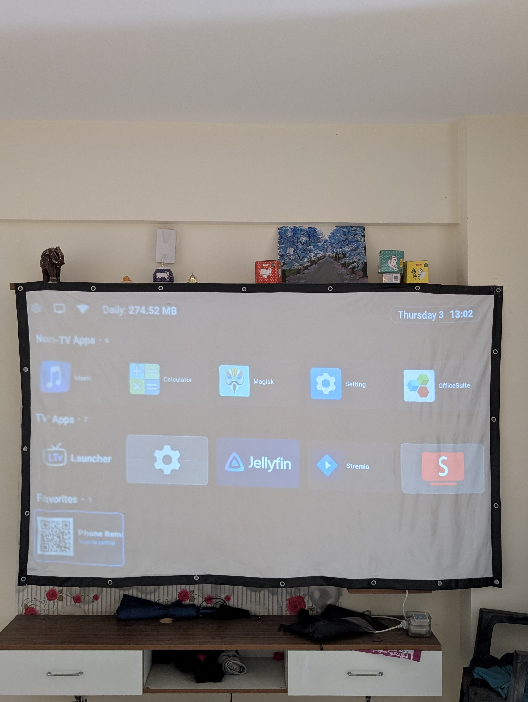
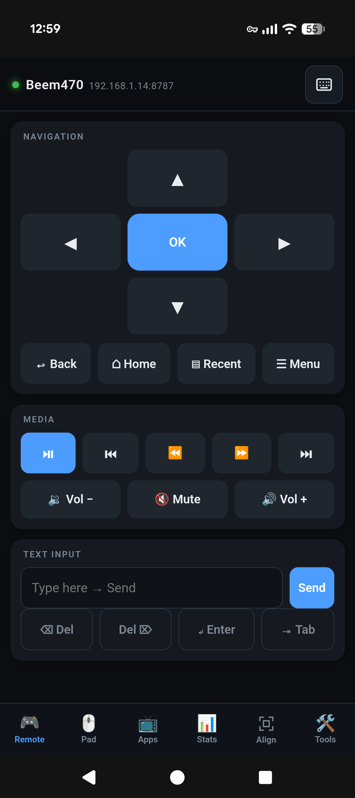
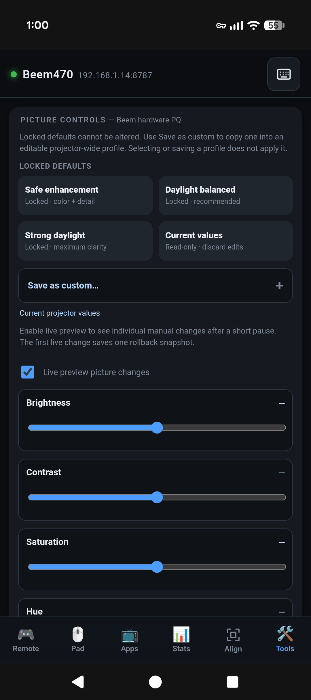
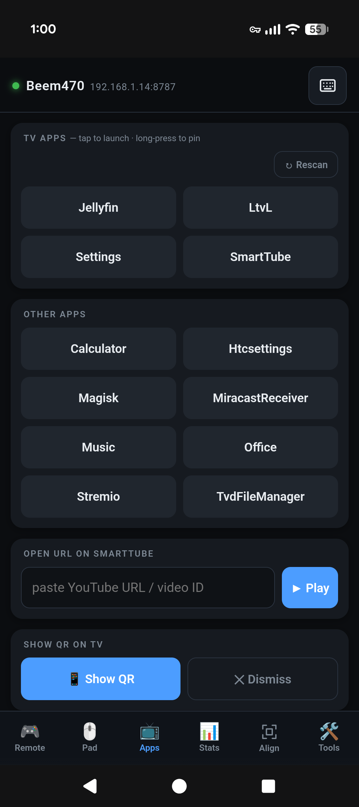
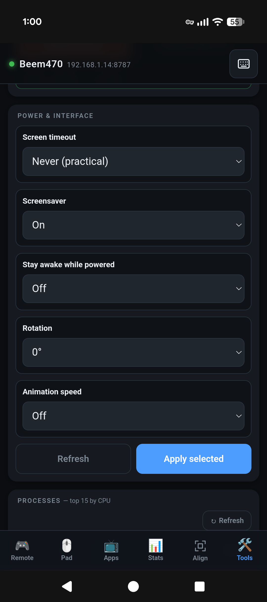
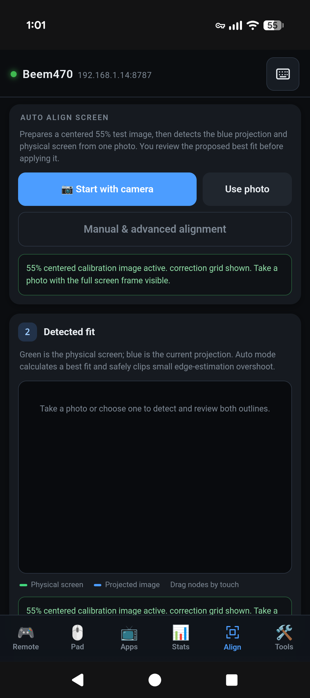
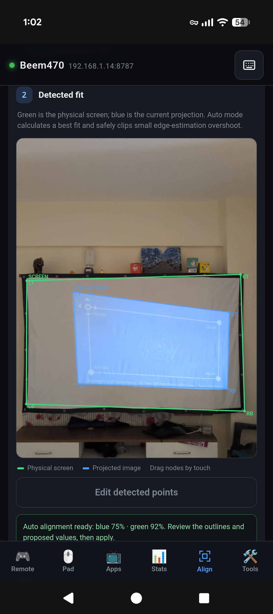
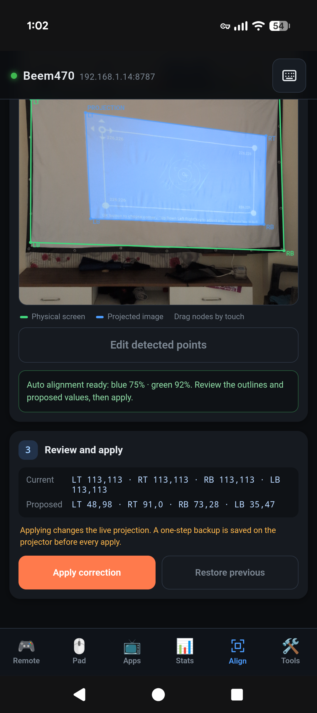
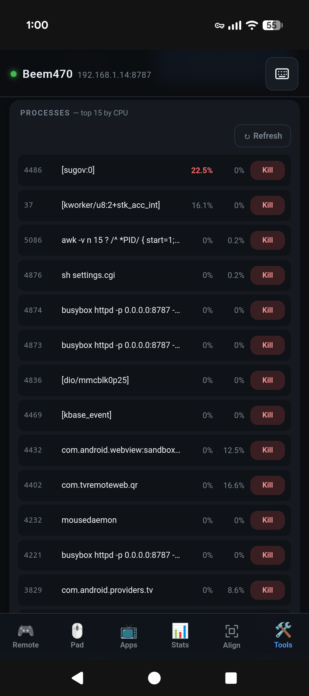
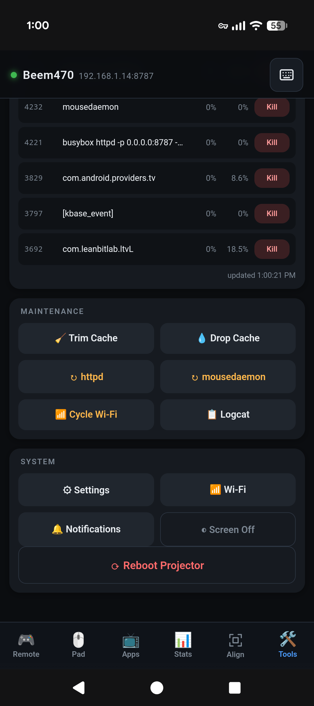

# TVRemoteWeb

A Magisk module that turns any rooted Android TV box or projector into
something you can drive from a phone browser — no app to install on the phone,
no cloud, no pairing. Join the same Wi-Fi, open a URL, and you have a D-pad, a
real mouse touchpad, an app launcher, and a system monitor.

The whole server is BusyBox `httpd` plus a handful of shell CGI scripts, so the
resident footprint is well under a megabyte.

The optional [Hermes projector agent](agent/README.md) adds scoped wireless
configuration plus review-before-apply photo keystone and picture tuning for
the Beem 470 reference device.

```
        phone browser  ──HTTP──▶  busybox httpd  ──▶  shell CGI  ──▶  input / am / pm
                       ──WS────▶  mousedaemon    ──▶  /dev/input/eventN
```

## Screenshots

<p align="center">
  
</p>
<p align="center"><em>Running on the Beem 470 reference projector.</em></p>

| Remote and apps | Projector controls |
|:---:|:---:|
| <br>Navigation, media and text input | <br>Picture profiles and live tuning |
| <br>Application launcher | <br>Power and interface settings |

| Photo-assisted alignment | Review and apply |
|:---:|:---:|
| <br>Start from the camera or an existing photo | <br>Review detected screen and projection edges |
| <br>Apply or restore the proposed correction | <br>Inspect CPU and RAM usage |

<details>
<summary><strong>More maintenance controls</strong></summary>
<br>
<p align="center">
  
</p>
</details>

## Why

Android TV remotes are miserable for anything involving text or a cursor, and
most "phone remote" apps need an app on both ends, a cloud account, or a
pairing dance. This is a web page served by the box itself.

## Features

- **D-pad, media keys, volume** — the normal remote, but responsive
- **Real mouse touchpad** — a native daemon writes `struct input_event`
  straight to an evdev node over a WebSocket. Roughly 10 ms per motion event
  versus ~80 ms for the shell-out path it replaced, which is the difference
  between a usable cursor and an unusable one.
- **Text input** — type on the phone keyboard instead of hunting an on-screen grid
- **Persistent keyboard shortcut** — open text input from any remote tab
- **Latched mouse Hold/Release** — drag Android objects with the real pointer
- **App launcher** — enumerated live from the device; long-press to pin favourites
- **Send a URL to the TV** — paste a link, it opens in the app you choose
- **On-demand casting** — launch an installed Miracast, AirPlay, or DLNA
  firmware receiver from the Apps tab, then stop it to release its RAM; the
  module adds no resident casting service
- **System monitor** — CPU and GPU temperature, frequency, load, RAM, swap,
  storage, uptime
- **Process manager** — top processes by CPU, with a kill button
- **Maintenance** — trim caches, drop page cache, cycle Wi-Fi, restart services,
  tail logcat
- **Advanced settings** — timeout (including practical Never), screensaver,
  stay-awake, rotation, animation speed, on-demand Bluetooth power/pairing/device
  management, and the Beem's 13-channel hardware picture profile with staged
  apply and rollback
- **Keystone Lab** — automatically detect the physical screen and projected
  image from a phone photo, refine either set of corners with draggable nodes,
  preview, apply, re-edit, and roll back; its simple default flow starts at a
  centered 55% image while the full manual alignment controls stay available
- **QR tile on the home screen** — a tiny bundled launcher app that shows a QR
  of the current address, regenerated on every open so it survives DHCP changes

## Requirements

- Android TV / Android 7+ with **Magisk** root
- BusyBox (Magisk's built-in one is used)
- Phone and TV on the same LAN

## Install

1. Grab `tvremoteweb-vX.Y.Z.zip` from
   [Releases](https://github.com/disc0nnctd/TVRemoteWeb/releases)
2. Magisk → Modules → *Install from storage*
3. Reboot
4. Open the **Phone Remote QR** tile on your home screen and scan it, or:

```sh
su -c 'cat /data/adb/tvremoteweb/url.txt'
```

The installer generates a random access token on first flash. Its 6-character
PIN is shown during install and is required as `?token=` on every request. The
token is never committed to this repo and differs on every device.

## Configuration

Optional, at `/data/adb/tvremoteweb/settings.conf`:

```ini
port=8787          # web UI
ws_port=8788       # mouse daemon
```

Disable the boot QR splash:

```sh
su -c 'touch /data/adb/tvremoteweb/no-splash'
```

or use the Apps tab in the remote.

## How the pointer works

Android has no supported API for injecting a *relative* cursor from a shell.
`input tap` and `input swipe` fake a touchscreen, which is why touch-emulating
remotes feel wrong — there is no cursor, just teleporting taps.

Instead, `mousedaemon` scans `/dev/input/event*` for a node that advertises
`REL_X`, `REL_Y` and `BTN_LEFT` while *not* advertising `EV_ABS`, and writes
input events to it directly. Many TV boxes already have such a node because the
IR receiver exposes one — on Allwinner H713 hardware it is `sunxi-ir-uinput`.
Android's InputReader then draws and moves a genuine system cursor.

If no such node exists, the daemon creates its own virtual mouse through
`/dev/uinput` and uses that. Either way you get a real pointer rather than
simulated touches.

Force a specific node with `TVR_EVDEV=/dev/input/eventN` if auto-detection picks
badly.

## Security

This is designed for a home LAN and the threat model is "someone else on my
Wi-Fi", not "the public internet".

- Every endpoint requires the token; requests without it get `403`
- The token file is `0600` and root-owned
- The WebSocket refuses every command until the token frame arrives
- **Traffic is plain HTTP and the token is in the query string.** Anyone who
  can watch your LAN traffic can lift it.
- **Do not port-forward this.** The CGI layer runs as root by design, since
  that is what `pm`, `input` and evdev writes require.

Rotate the token by deleting `/data/adb/tvremoteweb/token` and rebooting.

## Building

Everything is reproducible without Android Studio or Gradle.

```sh
# pointer daemon — static binaries, no runtime deps
src/mousedaemon/build.sh          # needs arm/aarch64 gcc cross-compilers

# QR tile APK — hand-written smali, assembled by apktool
src/app/build.sh                  # needs apktool, zipalign, apksigner, JDK

# Beem Allwinner picture-control bridge
tools/build-pqcli.sh              # needs smali

# package the module
tools/make-module-zip.sh
```

`src/app` is deliberately smali rather than Java: the app is one activity
hosting one WebView, and this keeps the toolchain to apktool plus the Android
build-tools instead of a full SDK and Gradle.

Note that `resources.arsc` must be **stored uncompressed and 4-byte aligned** or
Android 11+ rejects the install with `INSTALL_PARSE_FAILED_...-124`. The build
script handles this; if you repackage by hand, keep it in mind.

## Layout

```
module/                 Magisk module (this is what gets zipped)
  customize.sh          install: pick ABI, generate token, install the tile APK
  service.sh            boot: start httpd + mousedaemon, publish the URL
  files/
    remote.html         the entire phone UI, one file
    keystone.js         photo-coordinate validation and projective transform
    pqcli.dex            minimal bridge to the Beem vendor picture service
    qrcode.js           QR rendering (MIT, Kazuhiko Arase)
    cgi-bin/*.cgi       remote / stats / apps / qr endpoints
    bin/mousedaemon-*   static per-ABI pointer daemons
    app/*.apk           bundled QR launcher tile
src/                    sources for native, APK, and picture-control helpers
tools/                  packaging
```

## Tested on

| Device | SoC | Android | ABI | Notes |
|---|---|---|---|---|
| Beem 470 (ADT-3) | Allwinner H713 | 11 | armeabi-v7a | reference device; pointer node is `sunxi-ir-uinput` |

Reports from other hardware are welcome — the pointer detection and ABI
selection are the parts most likely to need adjusting.

## Licence

MIT — see [LICENSE](LICENSE).

Bundles [qrcode.js](https://github.com/kazuhikoarase/qrcode-generator) by
Kazuhiko Arase, also MIT.
